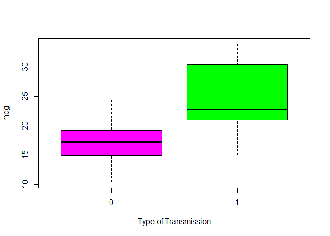
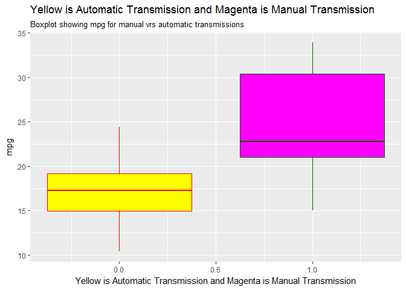
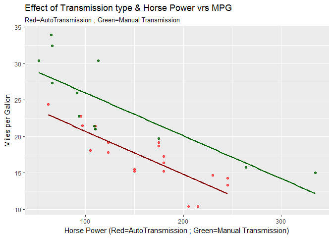
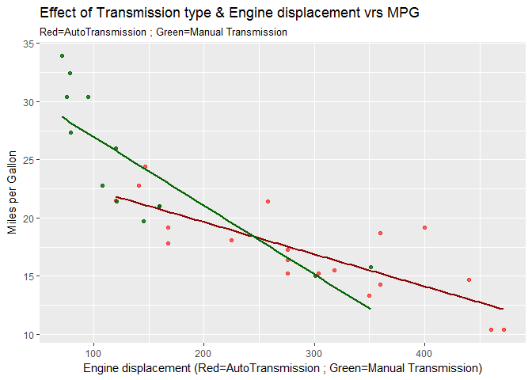
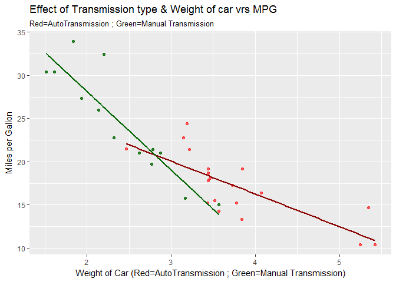

OVERVIEW
========

#### You work for Motor Trend, a magazine about the automobile industry. Looking at a data set of a collection of cars, they are interested in exploring the relationship between a set of variables and miles per gallon (MPG) (outcome). They are particularly interested in the following two questions:

### 1) “Is an automatic or manual transmission better for MPG”

### 2) "Quantify the MPG difference between automatic and manual transmissions"

### setup

    ## Warning: package 'ggplot2' was built under R version 3.3.3

    ## Warning: package 'dplyr' was built under R version 3.3.3

    ## 
    ## Attaching package: 'dplyr'

    ## The following objects are masked from 'package:stats':
    ## 
    ##     filter, lag

    ## The following objects are masked from 'package:base':
    ## 
    ##     intersect, setdiff, setequal, union

### first look - note that df2 is a data base with only automatic transmissions and df3 is a data base with only manual transmissions.

    data(mtcars)
    df1<-tbl_df(mtcars)
    df2<-filter(df1,am==0)
    df3<-filter(df1,am==1)

    df1

    ## # A tibble: 32 × 11
    ##      mpg   cyl  disp    hp  drat    wt  qsec    vs    am  gear  carb
    ## *  <dbl> <dbl> <dbl> <dbl> <dbl> <dbl> <dbl> <dbl> <dbl> <dbl> <dbl>
    ## 1   21.0     6 160.0   110  3.90 2.620 16.46     0     1     4     4
    ## 2   21.0     6 160.0   110  3.90 2.875 17.02     0     1     4     4
    ## 3   22.8     4 108.0    93  3.85 2.320 18.61     1     1     4     1
    ## 4   21.4     6 258.0   110  3.08 3.215 19.44     1     0     3     1
    ## 5   18.7     8 360.0   175  3.15 3.440 17.02     0     0     3     2
    ## 6   18.1     6 225.0   105  2.76 3.460 20.22     1     0     3     1
    ## 7   14.3     8 360.0   245  3.21 3.570 15.84     0     0     3     4
    ## 8   24.4     4 146.7    62  3.69 3.190 20.00     1     0     4     2
    ## 9   22.8     4 140.8    95  3.92 3.150 22.90     1     0     4     2
    ## 10  19.2     6 167.6   123  3.92 3.440 18.30     1     0     4     4
    ## # ... with 22 more rows

Note that since automatic transmissions are often standard on large(weight), powerful(hp) cars with big engines(disp) and manual transmission are often common on small basic under powered cars - that just looking at cars with automatic transmissions vrs manual transmissions could be misleading. Therefore I adjusted for differences in horse power, engine displacement and overall car weight. The assumption that mpg is impacted by hp, engine displacement and weight was tested and confirmed below. First let's look at a simple boxplot of mpg vrs transmission type (no adjustments for other factors).
------------------------------------------------------------------------------------------------------------------------------------------------------------------------------------------------------------------------------------------------------------------------------------------------------------------------------------------------------------------------------------------------------------------------------------------------------------------------------------------------------------------------------------------------------------------------------------------------------------------------

    boxplot(mpg ~ am, data = mtcars, col = (c("magenta","green")), ylab = "mpg", xlab = "Type of Transmission")

    ##or ggplot 
    gg<-ggplot(df1,aes(x=am,y=mpg))+geom_boxplot(aes(group=am),color=c("red","dark green"),fill=c("yellow","magenta"))+
    labs(x="Yellow is Automatic Transmission and Magenta is Manual Transmission")+
    labs(subtitle="Boxplot showing mpg for manual vrs automatic transmissions")+
    labs(title="Yellow is Automatic Transmission and Magenta is Manual Transmission")
    gg

#### The above boxplot shows that of the cars tested, manual transmissions have significantly higher mpg ratings than automatic transmissions.

### Next lets look at scatterplots with linear regression smoothers with hp, disp & weight vrs mpg - each plot will compare between auto and manual transmissions (df2 and df3 databases).

    g1<- ggplot()+
            geom_point(aes(x=df2$hp,y=df2$mpg),color="red",alpha=.6)+
            geom_smooth(aes(x=df2$hp,y=df2$mpg),method="lm",color="dark red",se=F)+
            geom_point(aes(x=df3$hp,y=df3$mpg),color="darkgreen",alpha=.8)+
            geom_smooth(aes(x=df3$hp,y=df3$mpg),method="lm",color="dark green",se=F)+
            labs(title="Effect of Transmission type & Horse Power vrs MPG")+
            labs(subtitle="Red=AutoTransmission ; Green=Manual Transmission")+
            labs(x="Horse Power (Red=AutoTransmission ; Green=Manual Transmission)",y="Miles per Gallon")
    g1       

    g2<- ggplot()+
            geom_point(aes(x=df2$disp,y=df2$mpg),color="red",alpha=.6)+
            geom_smooth(aes(x=df2$disp,y=df2$mpg),method="lm",color="dark red",se=F)+
            geom_point(aes(x=df3$disp,y=df3$mpg),color="darkgreen",alpha=.8)+
            geom_smooth(aes(x=df3$disp,y=df3$mpg),method="lm",color="dark green",se=F)+
            labs(title="Effect of Transmission type & Engine displacement vrs MPG")+
            labs(subtitle="Red=AutoTransmission ; Green=Manual Transmission")+
            labs(x="Engine displacement (Red=AutoTransmission ; Green=Manual Transmission)",y="Miles per Gallon")
    g2  

    g3<- ggplot()+
            geom_point(aes(x=df2$wt,y=df2$mpg),color="red",alpha=.6)+
            geom_smooth(aes(x=df2$wt,y=df2$mpg),method="lm",color="dark red",se=F)+
            geom_point(aes(x=df3$wt,y=df3$mpg),color="darkgreen",alpha=.8)+
            geom_smooth(aes(x=df3$wt,y=df3$mpg),method="lm",color="dark green",se=F)+
            labs(title="Effect of Transmission type & Weight of car vrs MPG")+
            labs(subtitle="Red=AutoTransmission ; Green=Manual Transmission")+
            labs(x="Weight of Car (Red=AutoTransmission ; Green=Manual Transmission)" ,y="Miles per Gallon")
    g3  

#### The above plots appear to show that manual transmissions get better mileage than automatic transmission - even when accounting for differences in hp, displacement and weight. Let's look more and try to quantify the differences.

### Assuming that mpg is impacted by hp, engine displacement and weight - lets look at average mpg for auto vrs manual transmissions - we will adjust for hp, displacement and weight.

    avgauto<-round((mean(df2$mpg)*10)/mean(df2$hp),5)
    avgman<-round((mean(df3$mpg)*10)/mean(df3$hp),5)
    a1<-c("Auto mpg/hp",avgauto,"vrs","Man mpg/hp",avgman)
    avgauto2<-round((mean(df2$mpg)*10)/mean(df2$disp),5)
    avgman2<-round((mean(df3$mpg)*10)/mean(df3$disp),5)
    a2<-c("Auto mpg/disp",avgauto2,"vrs","Man mpg/disp",avgman2)
    avgauto3<-round((mean(df2$mpg)*10)/mean(df2$wt),5)
    avgman3<-round((mean(df3$mpg)*10)/mean(df3$wt),5)
    a3<-c("Auto mpg/wt",avgauto3,"vrs","Man mpg/wt",avgman3)

    a1

    ## [1] "Auto mpg/hp" "1.06995"     "vrs"         "Man mpg/hp"  "1.92298"

    a2

    ## [1] "Auto mpg/disp" "0.59052"       "vrs"           "Man mpg/disp" 
    ## [5] "1.69945"

    a3

    ## [1] "Auto mpg/wt" "45.49707"    "vrs"         "Man mpg/wt"  "101.17092"

#### The above ratios of mpg/hp, mpg/disp and mpg/wt for cars with automatic transmissions vrs cars with manual transmitions would clearly indicate that the cars tested with manual transmissions have significantly better mpg than the cars tested with auto transmissions. The following code provides the percentage difference (how much better mpg does the manual get vrs the auto in percentage) between manual and auto transmissions based as follows:

### 1) mpg for manual transmissions are 79.7% higher than for auto transmissions adjusted for differences in horse power.

### 2) mpg for manual transmissions are 187.8% higher than for auto transmissions adjusted for differences in engine displacement.

### 3) mpg for manual transmissions are 122.4% higher than for auto transmissions adjusted for differences in weight.

    mpg_hp<-round((avgman-avgauto)/avgauto,3)

    mpg_disp<-round((avgman2-avgauto2)/avgauto2,3)

    mpg_wt<-round((avgman3-avgauto3)/avgauto3,3)

    c("Percentage higher avg mpg for manual vrs auto adjusted for hp",mpg_hp*100)

    ## [1] "Percentage higher avg mpg for manual vrs auto adjusted for hp"
    ## [2] "79.7"

    c("Percentage higher avg mpg for manual vrs auto adjusted for disp",mpg_disp*100)

    ## [1] "Percentage higher avg mpg for manual vrs auto adjusted for disp"
    ## [2] "187.8"

    c("Percentage higher avg mpg for manual vrs auto adjusted for wt",mpg_wt*100)

    ## [1] "Percentage higher avg mpg for manual vrs auto adjusted for wt"
    ## [2] "122.4"

The assignment made the following statements:
---------------------------------------------

### 1) When measuring MPG, manual transmissions perform better than automatic transmissions by 7.25MPG, however this single factor only accounts for 36% of the explanation

### 2) When measuring MPG, manual transmissions provide an additional 1.48MPG of performance over automatic transmissions when taking into account three additonal explanatory variables (cylinders, horsepower & weight), these additional factors account for 85% of the explanation

### Let's look at the above statements:

    statement1<-mean(df3$mpg)-mean(df2$mpg)
    statement1

    ## [1] 7.244939

    man<-lm(mpg~cyl+hp+wt,df3)
    auto<-lm(mpg~cyl+hp+wt,df2)
    summary(man)

    ## 
    ## Call:
    ## lm(formula = mpg ~ cyl + hp + wt, data = df3)
    ## 
    ## Residuals:
    ##     Min      1Q  Median      3Q     Max 
    ## -3.0259 -1.2918 -0.9867  0.2744  5.5044 
    ## 
    ## Coefficients:
    ##              Estimate Std. Error t value Pr(>|t|)    
    ## (Intercept) 45.200980   4.607628   9.810  4.2e-06 ***
    ## cyl         -0.484090   1.366919  -0.354   0.7314    
    ## hp          -0.007558   0.023131  -0.327   0.7513    
    ## wt          -7.213709   2.579060  -2.797   0.0208 *  
    ## ---
    ## Signif. codes:  0 '***' 0.001 '**' 0.01 '*' 0.05 '.' 0.1 ' ' 1
    ## 
    ## Residual standard error: 2.855 on 9 degrees of freedom
    ## Multiple R-squared:  0.8392, Adjusted R-squared:  0.7856 
    ## F-statistic: 15.65 on 3 and 9 DF,  p-value: 0.0006465

    summary(auto)

    ## 
    ## Call:
    ## lm(formula = mpg ~ cyl + hp + wt, data = df2)
    ## 
    ## Residuals:
    ##     Min      1Q  Median      3Q     Max 
    ## -2.2693 -1.6016 -0.3866  1.3423  3.3022 
    ## 
    ## Coefficients:
    ##             Estimate Std. Error t value Pr(>|t|)    
    ## (Intercept) 32.73699    2.73120  11.986 4.39e-09 ***
    ## cyl         -0.71841    0.54972  -1.307   0.2109    
    ## hp          -0.02429    0.01712  -1.419   0.1764    
    ## wt          -1.77914    0.79525  -2.237   0.0409 *  
    ## ---
    ## Signif. codes:  0 '***' 0.001 '**' 0.01 '*' 0.05 '.' 0.1 ' ' 1
    ## 
    ## Residual standard error: 1.918 on 15 degrees of freedom
    ## Multiple R-squared:  0.7913, Adjusted R-squared:  0.7496 
    ## F-statistic: 18.96 on 3 and 15 DF,  p-value: 2.303e-05

### The statements appear to be true

Synopsis
========

#### The addendum summaries show that for hp, wt and disp there is strong evidence that mpg goes down as each of the above increase - the trends are not significantly impacted when the transmission type is included in the regression model. Note that including all the variables seems to produce a lot of "noise" making the results less useful. Therefore the assumptions are support and the results shown above and copied here are supported:

### 1) mpg for manual transmissions are 79.7% higher than for auto transmissions adjusted for differences in horse power.

### 2) mpg for manual transmissions are 187.8% higher than for auto transmissions adjusted for differences in engine displacement.

### 3) mpg for manual transmissions are 122.4% higher than for auto transmissions adjusted for differences in weight.

Addendum
========

### Initial data summaries

    summary(df1)

    ##       mpg             cyl             disp             hp       
    ##  Min.   :10.40   Min.   :4.000   Min.   : 71.1   Min.   : 52.0  
    ##  1st Qu.:15.43   1st Qu.:4.000   1st Qu.:120.8   1st Qu.: 96.5  
    ##  Median :19.20   Median :6.000   Median :196.3   Median :123.0  
    ##  Mean   :20.09   Mean   :6.188   Mean   :230.7   Mean   :146.7  
    ##  3rd Qu.:22.80   3rd Qu.:8.000   3rd Qu.:326.0   3rd Qu.:180.0  
    ##  Max.   :33.90   Max.   :8.000   Max.   :472.0   Max.   :335.0  
    ##       drat             wt             qsec             vs        
    ##  Min.   :2.760   Min.   :1.513   Min.   :14.50   Min.   :0.0000  
    ##  1st Qu.:3.080   1st Qu.:2.581   1st Qu.:16.89   1st Qu.:0.0000  
    ##  Median :3.695   Median :3.325   Median :17.71   Median :0.0000  
    ##  Mean   :3.597   Mean   :3.217   Mean   :17.85   Mean   :0.4375  
    ##  3rd Qu.:3.920   3rd Qu.:3.610   3rd Qu.:18.90   3rd Qu.:1.0000  
    ##  Max.   :4.930   Max.   :5.424   Max.   :22.90   Max.   :1.0000  
    ##        am              gear            carb      
    ##  Min.   :0.0000   Min.   :3.000   Min.   :1.000  
    ##  1st Qu.:0.0000   1st Qu.:3.000   1st Qu.:2.000  
    ##  Median :0.0000   Median :4.000   Median :2.000  
    ##  Mean   :0.4062   Mean   :3.688   Mean   :2.812  
    ##  3rd Qu.:1.0000   3rd Qu.:4.000   3rd Qu.:4.000  
    ##  Max.   :1.0000   Max.   :5.000   Max.   :8.000

    df1

    ## # A tibble: 32 × 11
    ##      mpg   cyl  disp    hp  drat    wt  qsec    vs    am  gear  carb
    ## *  <dbl> <dbl> <dbl> <dbl> <dbl> <dbl> <dbl> <dbl> <dbl> <dbl> <dbl>
    ## 1   21.0     6 160.0   110  3.90 2.620 16.46     0     1     4     4
    ## 2   21.0     6 160.0   110  3.90 2.875 17.02     0     1     4     4
    ## 3   22.8     4 108.0    93  3.85 2.320 18.61     1     1     4     1
    ## 4   21.4     6 258.0   110  3.08 3.215 19.44     1     0     3     1
    ## 5   18.7     8 360.0   175  3.15 3.440 17.02     0     0     3     2
    ## 6   18.1     6 225.0   105  2.76 3.460 20.22     1     0     3     1
    ## 7   14.3     8 360.0   245  3.21 3.570 15.84     0     0     3     4
    ## 8   24.4     4 146.7    62  3.69 3.190 20.00     1     0     4     2
    ## 9   22.8     4 140.8    95  3.92 3.150 22.90     1     0     4     2
    ## 10  19.2     6 167.6   123  3.92 3.440 18.30     1     0     4     4
    ## # ... with 22 more rows

    df2

    ## # A tibble: 19 × 11
    ##      mpg   cyl  disp    hp  drat    wt  qsec    vs    am  gear  carb
    ##    <dbl> <dbl> <dbl> <dbl> <dbl> <dbl> <dbl> <dbl> <dbl> <dbl> <dbl>
    ## 1   21.4     6 258.0   110  3.08 3.215 19.44     1     0     3     1
    ## 2   18.7     8 360.0   175  3.15 3.440 17.02     0     0     3     2
    ## 3   18.1     6 225.0   105  2.76 3.460 20.22     1     0     3     1
    ## 4   14.3     8 360.0   245  3.21 3.570 15.84     0     0     3     4
    ## 5   24.4     4 146.7    62  3.69 3.190 20.00     1     0     4     2
    ## 6   22.8     4 140.8    95  3.92 3.150 22.90     1     0     4     2
    ## 7   19.2     6 167.6   123  3.92 3.440 18.30     1     0     4     4
    ## 8   17.8     6 167.6   123  3.92 3.440 18.90     1     0     4     4
    ## 9   16.4     8 275.8   180  3.07 4.070 17.40     0     0     3     3
    ## 10  17.3     8 275.8   180  3.07 3.730 17.60     0     0     3     3
    ## 11  15.2     8 275.8   180  3.07 3.780 18.00     0     0     3     3
    ## 12  10.4     8 472.0   205  2.93 5.250 17.98     0     0     3     4
    ## 13  10.4     8 460.0   215  3.00 5.424 17.82     0     0     3     4
    ## 14  14.7     8 440.0   230  3.23 5.345 17.42     0     0     3     4
    ## 15  21.5     4 120.1    97  3.70 2.465 20.01     1     0     3     1
    ## 16  15.5     8 318.0   150  2.76 3.520 16.87     0     0     3     2
    ## 17  15.2     8 304.0   150  3.15 3.435 17.30     0     0     3     2
    ## 18  13.3     8 350.0   245  3.73 3.840 15.41     0     0     3     4
    ## 19  19.2     8 400.0   175  3.08 3.845 17.05     0     0     3     2

    df3

    ## # A tibble: 13 × 11
    ##      mpg   cyl  disp    hp  drat    wt  qsec    vs    am  gear  carb
    ##    <dbl> <dbl> <dbl> <dbl> <dbl> <dbl> <dbl> <dbl> <dbl> <dbl> <dbl>
    ## 1   21.0     6 160.0   110  3.90 2.620 16.46     0     1     4     4
    ## 2   21.0     6 160.0   110  3.90 2.875 17.02     0     1     4     4
    ## 3   22.8     4 108.0    93  3.85 2.320 18.61     1     1     4     1
    ## 4   32.4     4  78.7    66  4.08 2.200 19.47     1     1     4     1
    ## 5   30.4     4  75.7    52  4.93 1.615 18.52     1     1     4     2
    ## 6   33.9     4  71.1    65  4.22 1.835 19.90     1     1     4     1
    ## 7   27.3     4  79.0    66  4.08 1.935 18.90     1     1     4     1
    ## 8   26.0     4 120.3    91  4.43 2.140 16.70     0     1     5     2
    ## 9   30.4     4  95.1   113  3.77 1.513 16.90     1     1     5     2
    ## 10  15.8     8 351.0   264  4.22 3.170 14.50     0     1     5     4
    ## 11  19.7     6 145.0   175  3.62 2.770 15.50     0     1     5     6
    ## 12  15.0     8 301.0   335  3.54 3.570 14.60     0     1     5     8
    ## 13  21.4     4 121.0   109  4.11 2.780 18.60     1     1     4     2

Test assumptions
----------------

#### Note that the above generated conclusions (showing manual transmissions having significantly higher mpg than automatic transmissions) is based upon the mpg being related to the variables horsepower, engine displacement and car weight. Lets test these assumptions:

    fit<-lm(mpg~.,df1)
    summary(fit)

    ## 
    ## Call:
    ## lm(formula = mpg ~ ., data = df1)
    ## 
    ## Residuals:
    ##     Min      1Q  Median      3Q     Max 
    ## -3.4506 -1.6044 -0.1196  1.2193  4.6271 
    ## 
    ## Coefficients:
    ##             Estimate Std. Error t value Pr(>|t|)  
    ## (Intercept) 12.30337   18.71788   0.657   0.5181  
    ## cyl         -0.11144    1.04502  -0.107   0.9161  
    ## disp         0.01334    0.01786   0.747   0.4635  
    ## hp          -0.02148    0.02177  -0.987   0.3350  
    ## drat         0.78711    1.63537   0.481   0.6353  
    ## wt          -3.71530    1.89441  -1.961   0.0633 .
    ## qsec         0.82104    0.73084   1.123   0.2739  
    ## vs           0.31776    2.10451   0.151   0.8814  
    ## am           2.52023    2.05665   1.225   0.2340  
    ## gear         0.65541    1.49326   0.439   0.6652  
    ## carb        -0.19942    0.82875  -0.241   0.8122  
    ## ---
    ## Signif. codes:  0 '***' 0.001 '**' 0.01 '*' 0.05 '.' 0.1 ' ' 1
    ## 
    ## Residual standard error: 2.65 on 21 degrees of freedom
    ## Multiple R-squared:  0.869,  Adjusted R-squared:  0.8066 
    ## F-statistic: 13.93 on 10 and 21 DF,  p-value: 3.793e-07

    fit1<-lm(mpg~hp+am,df1)
    fit2<-lm(mpg~disp+am,df1)
    fit3<-lm(mpg~wt+am,df1)

    summary(fit1)

    ## 
    ## Call:
    ## lm(formula = mpg ~ hp + am, data = df1)
    ## 
    ## Residuals:
    ##     Min      1Q  Median      3Q     Max 
    ## -4.3843 -2.2642  0.1366  1.6968  5.8657 
    ## 
    ## Coefficients:
    ##              Estimate Std. Error t value Pr(>|t|)    
    ## (Intercept) 26.584914   1.425094  18.655  < 2e-16 ***
    ## hp          -0.058888   0.007857  -7.495 2.92e-08 ***
    ## am           5.277085   1.079541   4.888 3.46e-05 ***
    ## ---
    ## Signif. codes:  0 '***' 0.001 '**' 0.01 '*' 0.05 '.' 0.1 ' ' 1
    ## 
    ## Residual standard error: 2.909 on 29 degrees of freedom
    ## Multiple R-squared:  0.782,  Adjusted R-squared:  0.767 
    ## F-statistic: 52.02 on 2 and 29 DF,  p-value: 2.55e-10

    summary(fit2)

    ## 
    ## Call:
    ## lm(formula = mpg ~ disp + am, data = df1)
    ## 
    ## Residuals:
    ##     Min      1Q  Median      3Q     Max 
    ## -4.6382 -2.4751 -0.5631  2.2333  6.8386 
    ## 
    ## Coefficients:
    ##              Estimate Std. Error t value Pr(>|t|)    
    ## (Intercept) 27.848081   1.834071  15.184 2.45e-15 ***
    ## disp        -0.036851   0.005782  -6.373 5.75e-07 ***
    ## am           1.833458   1.436100   1.277    0.212    
    ## ---
    ## Signif. codes:  0 '***' 0.001 '**' 0.01 '*' 0.05 '.' 0.1 ' ' 1
    ## 
    ## Residual standard error: 3.218 on 29 degrees of freedom
    ## Multiple R-squared:  0.7333, Adjusted R-squared:  0.7149 
    ## F-statistic: 39.87 on 2 and 29 DF,  p-value: 4.749e-09

    summary(fit3)

    ## 
    ## Call:
    ## lm(formula = mpg ~ wt + am, data = df1)
    ## 
    ## Residuals:
    ##     Min      1Q  Median      3Q     Max 
    ## -4.5295 -2.3619 -0.1317  1.4025  6.8782 
    ## 
    ## Coefficients:
    ##             Estimate Std. Error t value Pr(>|t|)    
    ## (Intercept) 37.32155    3.05464  12.218 5.84e-13 ***
    ## wt          -5.35281    0.78824  -6.791 1.87e-07 ***
    ## am          -0.02362    1.54565  -0.015    0.988    
    ## ---
    ## Signif. codes:  0 '***' 0.001 '**' 0.01 '*' 0.05 '.' 0.1 ' ' 1
    ## 
    ## Residual standard error: 3.098 on 29 degrees of freedom
    ## Multiple R-squared:  0.7528, Adjusted R-squared:  0.7358 
    ## F-statistic: 44.17 on 2 and 29 DF,  p-value: 1.579e-09

    fit4<-lm(mpg~hp,df1)
    fit5<-lm(mpg~disp,df1)
    fit6<-lm(mpg~wt,df1)

    summary(fit4)

    ## 
    ## Call:
    ## lm(formula = mpg ~ hp, data = df1)
    ## 
    ## Residuals:
    ##     Min      1Q  Median      3Q     Max 
    ## -5.7121 -2.1122 -0.8854  1.5819  8.2360 
    ## 
    ## Coefficients:
    ##             Estimate Std. Error t value Pr(>|t|)    
    ## (Intercept) 30.09886    1.63392  18.421  < 2e-16 ***
    ## hp          -0.06823    0.01012  -6.742 1.79e-07 ***
    ## ---
    ## Signif. codes:  0 '***' 0.001 '**' 0.01 '*' 0.05 '.' 0.1 ' ' 1
    ## 
    ## Residual standard error: 3.863 on 30 degrees of freedom
    ## Multiple R-squared:  0.6024, Adjusted R-squared:  0.5892 
    ## F-statistic: 45.46 on 1 and 30 DF,  p-value: 1.788e-07

    summary(fit5)

    ## 
    ## Call:
    ## lm(formula = mpg ~ disp, data = df1)
    ## 
    ## Residuals:
    ##     Min      1Q  Median      3Q     Max 
    ## -4.8922 -2.2022 -0.9631  1.6272  7.2305 
    ## 
    ## Coefficients:
    ##              Estimate Std. Error t value Pr(>|t|)    
    ## (Intercept) 29.599855   1.229720  24.070  < 2e-16 ***
    ## disp        -0.041215   0.004712  -8.747 9.38e-10 ***
    ## ---
    ## Signif. codes:  0 '***' 0.001 '**' 0.01 '*' 0.05 '.' 0.1 ' ' 1
    ## 
    ## Residual standard error: 3.251 on 30 degrees of freedom
    ## Multiple R-squared:  0.7183, Adjusted R-squared:  0.709 
    ## F-statistic: 76.51 on 1 and 30 DF,  p-value: 9.38e-10

    summary(fit6)

    ## 
    ## Call:
    ## lm(formula = mpg ~ wt, data = df1)
    ## 
    ## Residuals:
    ##     Min      1Q  Median      3Q     Max 
    ## -4.5432 -2.3647 -0.1252  1.4096  6.8727 
    ## 
    ## Coefficients:
    ##             Estimate Std. Error t value Pr(>|t|)    
    ## (Intercept)  37.2851     1.8776  19.858  < 2e-16 ***
    ## wt           -5.3445     0.5591  -9.559 1.29e-10 ***
    ## ---
    ## Signif. codes:  0 '***' 0.001 '**' 0.01 '*' 0.05 '.' 0.1 ' ' 1
    ## 
    ## Residual standard error: 3.046 on 30 degrees of freedom
    ## Multiple R-squared:  0.7528, Adjusted R-squared:  0.7446 
    ## F-statistic: 91.38 on 1 and 30 DF,  p-value: 1.294e-10

#### See addendum for summaries of various linear regression models. The coefficient t-value is a measure of how many standard deviations our coefficient estimate is far away from 0. We want it to be far away from zero as this would indicate we could reject the null hypothesis - that is, we could declare a relationship between hp,disp & wt and y exist. In our example, the t-statistic values are relatively far away from zero and are large relative to the standard error, which could indicate a relationship exists. In general, t-values are also used to compute p-values.

#### F-statistic is a good indicator of whether there is a relationship between our predictor and the response variables. The further the F-statistic is from 1 the better it is. However, how much larger the F-statistic needs to be depends on both the number of data points and the number of predictors. Generally, when the number of data points is large, an F-statistic that is only a little bit larger than 1 is already sufficient to reject the null hypothesis (H0 : There is no relationship between x and y). The reverse is true as if the number of data points is small, a large F-statistic is required to be able to ascertain that there may be a relationship between predictor and response variables. In our example the F-statistic vary from 39 to 92 which are relatively larger than 1 given the size of our data.
